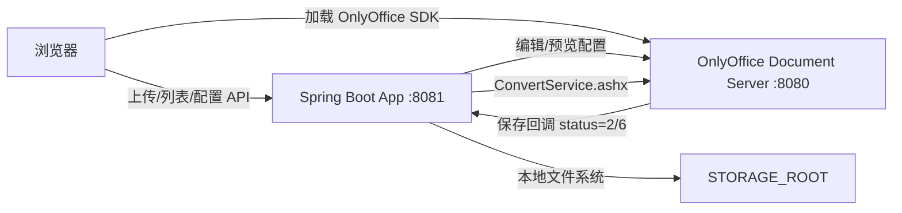
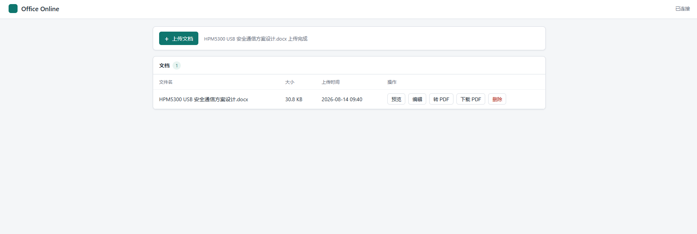
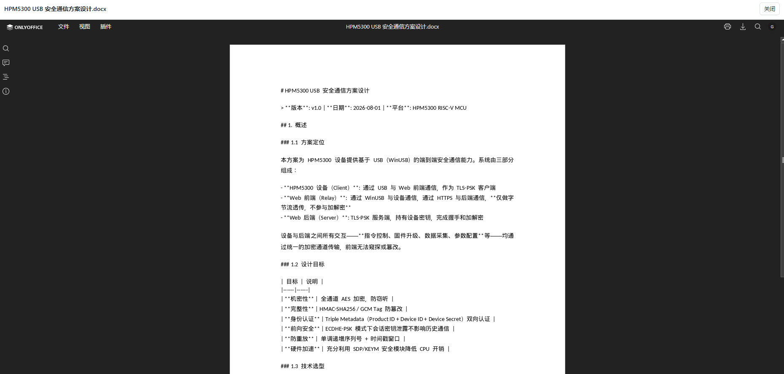
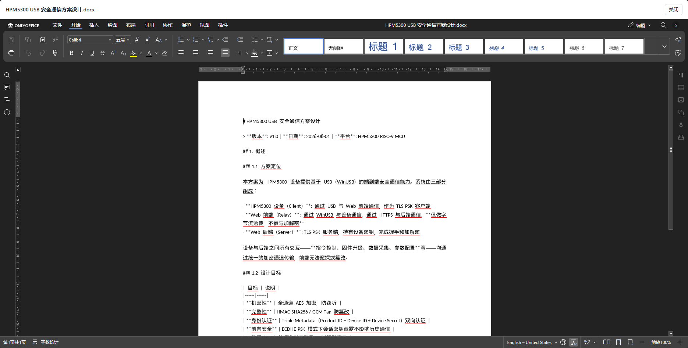

# Office Online 文档处理系统

基于 Spring Boot 3 + OnlyOffice Document Server 的在线文档系统，提供 Word/Excel/PPT 等 Office 文档的上传、在线预览、多人协同编辑、编辑回调保存，以及 Word 转 PDF。

## 功能

- `POST /api/documents/upload` 上传文档，支持 `.docx/.doc/.xlsx/.xls/.pptx/.ppt/.odt/.ods/.odp/.rtf/.txt/.csv`
- 文档列表与元数据接口
- `GET /api/documents/{id}/preview` 返回 OnlyOffice 只读编辑器配置
- `GET /api/documents/{id}/edit` 返回 OnlyOffice 编辑模式配置，含 `callbackUrl`
- `POST /api/onlyoffice/callback` 接收 OnlyOffice 保存回调并覆盖原文件
- `POST /api/documents/{id}/convert/pdf` 调用 Document Server `ConvertService.ashx` 转 PDF
- 原生 HTML/JS 单页前端，内嵌 `DocsAPI.DocEditor`
- 元数据默认存内存，通过 `DocumentMetadataStore` 接口预留数据库扩展点

## 架构



### 为什么直接集成 OnlyOffice，而不是 OfficeCLI

需求要求先阅读 [OfficeCLI README_zh](https://github.com/iOfficeAI/OfficeCLI/blob/main/README_zh.md)。阅读结论：

- OfficeCLI 是面向 AI 智能体的本地 CLI（`create/get/set/add/view/batch/watch/mcp`），提供结构化 JSON 输出和本地 HTML/PNG 渲染。
- OfficeCLI 不提供 OnlyOffice 编辑器所需的 `config` 生成接口，也没有封装 Document Server 的 `ConvertService.ashx` 转换 REST API。
- 因此本项目的预览、编辑、回调、PDF 转换全部直接集成 OnlyOffice Document Server 官方 API。
- `docker-compose.yml` 中仍保留一个 `officecli` 可选服务（`--profile officecli`），用于容器内辅助文档操作，不参与核心在线流程。

## 本地开发

前置条件：JDK 17+、Maven 3.8+、Docker（运行 OnlyOffice）。

本机 Maven 的全局 `settings.xml` 若指向不可写目录，可使用项目内配置构建：

```bash
mvn -s .mvn/user-settings.xml clean test
mvn -s .mvn/user-settings.xml spring-boot:run
```

启动前设置环境变量：

```powershell
$env:STORAGE_ROOT=".\data\files"
$env:ONLYOFFICE_URL="http://localhost:8080"
$env:APP_PUBLIC_URL="http://localhost:8081"
```

先启动 OnlyOffice：

```bash
docker compose up -d onlyoffice-document-server
```

然后访问 `http://localhost:8081`。

> 本地联调时 Document Server 容器需要能访问 App。若 App 跑在宿主机，可将 `APP_PUBLIC_URL` 设为 `http://host.docker.internal:8081`，或让 OnlyOffice 也通过宿主机 IP 访问。

## Linux + Docker 部署

1. 安装 Docker 与 Compose 插件：

```bash
sudo apt-get update
sudo apt-get install -y docker.io docker-compose-plugin
sudo systemctl enable --now docker
```

2. 构建并启动全部服务：

```bash
cd office-online-document-system
cp .env.example .env
docker compose up -d --build
docker compose ps
```

3. 查看日志：

```bash
docker compose logs -f app
docker compose logs -f onlyoffice-document-server
```

4. 停止：

```bash
docker compose down
```

保留数据卷可避免删除数据：`docker compose down` 不会删除 named volumes。

### 端口与反向代理

- OnlyOffice Document Server：`8080:80`
- 本应用：`8081:8081`
- 若使用 Nginx 反向代理，将 `/` 转发到 App，并为 Document Server 配置独立域名或路径，同时保持回调地址可被 Document Server 容器访问。
- 生产环境建议为 OnlyOffice 和 App 都启用 HTTPS，并限制上传大小（当前 100MB）。

### 对接已经运行的 OnlyOffice 容器

如果服务器上已经用 `docker run` 启动过 `onlyoffice-document-server`，不要再执行根目录的 `docker-compose.yml`，否则会重复创建同名容器并冲突 8080 端口。此时只部署 App 容器即可。

项目提供了 Linux 一键部署脚本 `deploy.sh`。把项目文件放到服务器后执行：

```bash
cd /app/office-online
bash deploy.sh
```

脚本会自动创建 `office-net` 网络、把 `onlyoffice-document-server` 容器接入网络，并启动 App 容器。

启动前建议显式设置 OnlyOffice 的浏览器访问地址，否则前端会拿容器内部地址加载 SDK：

```bash
export ONLYOFFICE_PUBLIC_URL=http://你的服务器IP:8080
bash deploy.sh
```

`ONLYOFFICE_URL` 只给后端用（容器间访问），`ONLYOFFICE_PUBLIC_URL` 给浏览器用（宿主机 IP 或域名）。

同时必须把 `APP_PUBLIC_URL` 设置为浏览器可访问的地址，否则文档列表、预览和 PDF 下载链接里会出现 `office-online-app` 这样的容器内部名字，浏览器无法打开。

> Docker 构建阶段使用 `docker/maven-settings.xml` 中的阿里云 Maven 镜像下载依赖，避免国内访问 Maven Central 过慢。

推荐让两个容器加入同一个 Docker 网络，用容器名互相访问：

```bash
docker network create office-net
docker network connect office-net onlyoffice-document-server

cd office-online-document-system
docker compose -f docker-compose.app.yml up -d --build
```

`docker-compose.app.yml` 只定义 `app` 服务，并假设：

- OnlyOffice 容器名是 `onlyoffice-document-server`
- OnlyOffice 内部端口是 80，通过共享网络访问地址为 `http://onlyoffice-document-server`
- App 容器名是 `office-online-app`，Document Server 通过 `http://office-online-app:8081` 回调

不想建自定义网络时，也可以直接用宿主机 IP 运行 App：

```bash
docker run -d \
  --name office-online-app \
  -p 8081:8081 \
  -e ONLYOFFICE_URL="http://<宿主机IP>:8080" \
  -e APP_PUBLIC_URL="http://<宿主机IP>:8081" \
  -e STORAGE_ROOT="/data/files" \
  -v /app/office-online/files:/data/files \
  --restart=always \
  office-online-app
```

如果你的 OnlyOffice 是用命令里的原版镜像启动的，还没有中文字体，先执行：

```bash
docker exec -u root onlyoffice-document-server bash -c "apt-get update && apt-get install -y --no-install-recommends fonts-noto-cjk && rm -rf /var/lib/apt/lists/*"
docker restart onlyoffice-document-server
docker exec onlyoffice-document-server fc-list :lang=zh
```

### 中文字体

`onlyoffice/Dockerfile` 在 Document Server 镜像中安装 `fonts-noto-cjk`，避免 PDF 转换出现中文乱码。验证：

```bash
docker exec office-online-onlyoffice fc-list :lang=zh
```

## 环境变量

| 变量 | 默认值 | 说明 |
|------|--------|------|
| `ONLYOFFICE_URL` | `http://localhost:8080` | Document Server 地址 |
| `ONLYOFFICE_PUBLIC_URL` | 空 | 浏览器可访问的 OnlyOffice 地址（如 `http://服务器IP:8080`）；不填时前端回退使用 `ONLYOFFICE_URL` |
| `APP_PUBLIC_URL` | `http://localhost:8081` | App 对外地址（浏览器与 OnlyOffice 都可访问），如 `http://服务器IP:8081` |
| `CALLBACK_URL` | 由 `APP_PUBLIC_URL` 推导 | 完整回调地址，缺省为 `{public-url}/api/onlyoffice/callback` |
| `STORAGE_ROOT` | `/data/files` | 文件存储根目录 |
| `ONLYOFFICE_JWT_SECRET` | 空 | 启用 OnlyOffice JWT 时的密钥；为空则不签名 |
| `ONLYOFFICE_JWT_ENABLED` | `false` | 仅影响 compose 中 Document Server 的 JWT 开关 |

## REST API

| 方法 | 路径 | 说明 |
|------|------|------|
| POST | `/api/documents/upload` | multipart 上传，字段名 `file` |
| GET | `/api/documents` | 文档元数据列表 |
| GET | `/api/documents/{id}/content` | 原始文件流 |
| GET | `/api/documents/{id}/preview` | 只读编辑器配置 |
| GET | `/api/documents/{id}/edit` | 编辑模式配置 |
| POST | `/api/documents/{id}/convert/pdf` | 转换 PDF |
| GET | `/api/documents/{id}/pdf/download` | 下载 PDF |
| DELETE | `/api/documents/{id}` | 删除文档 |
| POST | `/api/onlyoffice/callback` | OnlyOffice 保存回调 |
| GET | `/api/config` | 前端运行配置 |

### 上传示例

```bash
curl -F "file=@sample.docx" http://localhost:8081/api/documents/upload
```

响应：

```json
{
  "id": "3f1b2c6e-...",
  "filename": "sample.docx",
  "contentUrl": "http://localhost:8081/api/documents/3f1b2c6e-.../content",
  "previewUrl": "http://localhost:8081/api/documents/3f1b2c6e-.../preview",
  "editUrl": "http://localhost:8081/api/documents/3f1b2c6e-.../edit"
}
```

### 转换示例

```bash
curl -X POST http://localhost:8081/api/documents/{id}/convert/pdf
curl -OJ http://localhost:8081/api/documents/{id}/pdf/download
```

## OnlyOffice 集成说明

- 编辑配置中的 `document.key` 为 `{documentId}_{updatedAt 毫秒时间戳}`，文件保存回调后时间戳更新，key 自动变化，避免 Document Server 缓存旧版本。
- 回调状态 `2`（可保存）和 `6`（强制保存）会下载回调中的 `url` 并原子替换原文件。
- 回调返回 `{"error":0}` 表示成功，保存异常返回 `{"error":1}`。
- 配置了 `ONLYOFFICE_JWT_SECRET` 时，App 会对编辑器 config 和转换请求体生成 HS256 JWT；Document Server 需同步开启 `JWT_ENABLED=true` 并使用相同密钥。
- 文档内容通过 `GET /api/documents/{id}/content` 提供给 Document Server，不暴露物理路径。
- 转换接口同时兼容 JSON 与 XML 两种响应格式，均从响应中提取 `fileUrl`/`FileUrl`。
- 阿里云 OSS 对接方案见 [docs/OSS对接方案.md](docs/OSS对接方案.md)。

若打开预览/编辑时报“文档安全令牌的格式不正确”，说明 Document Server 已开启 JWT，而 App 没使用相同密钥。先查看 OnlyOffice 容器里的 JWT 配置：

```bash
docker exec onlyoffice-document-server env | grep JWT
```

如果没有任何输出，说明密钥写在 OnlyOffice 配置文件里，继续执行：

```bash
docker exec onlyoffice-document-server cat /etc/onlyoffice/documentserver/local.json
```

文件里 `"string"` 或 `"token"` 对应的值就是要填的密钥；如果找不到，可以先尝试默认值 `secret`。如果不打算使用 JWT，也可以在 OnlyOffice 容器启动参数中加 `-e JWT_ENABLED=false` 关闭令牌，同时把 App 的 `ONLYOFFICE_JWT_SECRET` 清空。

如果 `local.json` 中 `token.inbox.inBody` 为 `false`，说明转换请求的令牌要放在 `Authorization` 请求头里；本项目新版已按该方式传递，只需保证 App 与 OnlyOffice 使用相同 `ONLYOFFICE_JWT_SECRET`。

然后在 App 的 `.env` 中设置相同密钥并重建：

```bash
echo "ONLYOFFICE_JWT_SECRET=查到的密钥" >> /app/office-online/.env
cd /app/office-online
bash deploy.sh
```

## 测试

自动测试：

```bash
mvn -s .mvn/user-settings.xml clean test
```

覆盖存储、编辑器配置生成、JWT、MockWebServer 模拟转换与回调保存。

手动测试步骤：

1. 上传：

```bash
curl -F "file=@测试文档.docx" http://localhost:8081/api/documents/upload
```

2. 浏览器打开 `http://localhost:8081`，在列表中点击“预览”和“编辑”。
3. 在编辑器中修改内容并关闭，OnlyOffice 会回调保存；重新打开“预览”应能看到新内容，且 `updatedAt` 已更新。
4. 点击“转 PDF”，完成后点击“下载 PDF”检查内容，中文应无乱码。

## 项目结构

```text
.
├── pom.xml
├── Dockerfile
├── docker-compose.yml
├── onlyoffice/Dockerfile      # Document Server + 中文字体
├── officecli/Dockerfile       # 可选辅助容器
├── src/main/java/com/officeonline
│   ├── config/                # 环境配置
│   ├── document/              # 文档元数据、服务、REST 控制器、回调
│   ├── storage/               # 文件存储
│   ├── onlyoffice/            # 配置生成、转换客户端、JWT
│   └── exception/             # 统一异常
├── src/main/resources/static  # 原生前端
└── src/test                   # 单元与 MockWebServer 集成测试


```

效果预览：




