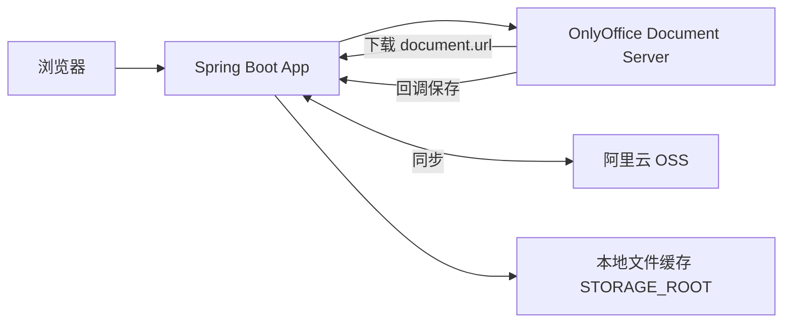

# 阿里云 OSS 对接方案

## 目标

项目中的 Word 文件存放在阿里云 OSS，需要：

- 在线预览
- 在线编辑并保存回 OSS
- Word 转 PDF，并把 PDF 上传到 OSS

当前系统已经完成本地存储版本的全部核心能力，OSS 对接是在此基础上的存储层改造。

## 核心原则

OnlyOffice Document Server 不直接读写 OSS，它只通过 HTTP URL 下载文档和回调保存。

因此保持本系统作为“文件代理 + OSS 同步层”：



OSS 是文档的最终存储，本地目录是工作缓存。

## 数据流

### 1. 上传

1. 用户上传 Word 到本系统
2. 本系统保存到本地缓存
3. 本系统上传到 OSS，记录 `ossKey`

### 2. 预览 / 编辑

1. 本系统检查本地是否存在文档
2. 本地缺失时从 OSS 下载到本地缓存
3. 生成 OnlyOffice 配置，`document.url` 指向本系统的 `/api/documents/{id}/content`
4. OnlyOffice 从本系统下载文档进行预览/编辑
5. 用户关闭编辑器后，OnlyOffice 回调本系统
6. 本系统保存新内容到本地，并上传覆盖 OSS 原文件

### 3. Word 转 PDF

1. 本系统调用 OnlyOffice `ConvertService.ashx`
2. OnlyOffice 返回 PDF 文件 URL（JSON 或 XML）
3. 本系统下载 PDF 到本地 `converted.pdf`
4. 本系统上传 PDF 到 OSS
5. 前端通过 `/api/documents/{id}/pdf/download` 下载

### 4. 删除

同时删除本地目录和 OSS 对象。

## OSS 对象命名

```text
{base-key}/{documentId}/{originalFilename}
{base-key}/{documentId}/converted.pdf
```

示例：

```text
office-online/3f1b2c6e-.../合同.docx
office-online/3f1b2c6e-.../converted.pdf
```

## 需要新增的配置

```yaml
app:
  oss:
    endpoint: ${OSS_ENDPOINT:}
    access-key-id: ${OSS_ACCESS_KEY_ID:}
    access-key-secret: ${OSS_ACCESS_KEY_SECRET:}
    bucket: ${OSS_BUCKET:}
    base-key: ${OSS_BASE_KEY:office-online/}
    public-base-url: ${OSS_PUBLIC_BASE_URL:}
```

对应环境变量：

| 变量 | 说明 |
|------|------|
| `OSS_ENDPOINT` | OSS Endpoint，如 `oss-cn-hangzhou.aliyuncs.com` |
| `OSS_ACCESS_KEY_ID` | AccessKey ID |
| `OSS_ACCESS_KEY_SECRET` | AccessKey Secret |
| `OSS_BUCKET` | Bucket 名称 |
| `OSS_BASE_KEY` | OSS 前缀目录，默认 `office-online/` |
| `OSS_PUBLIC_BASE_URL` | 可选，OSS 对外访问域名，用于生成签名下载地址 |

密钥通过环境变量注入，不写入代码和仓库。生产环境建议使用 RAM 子账号或 STS 临时凭证。

## 需要新增的依赖

```xml
<dependency>
    <groupId>com.aliyun.oss</groupId>
    <artifactId>aliyun-sdk-oss</artifactId>
    <version>3.17.4</version>
</dependency>
```

## 推荐代码改动点

### 1. 新增 OSS 服务

新增 `OssStorageService`，提供：

```java
void uploadFile(String ossKey, Path localPath);
void downloadFile(String ossKey, Path localPath);
void deleteObject(String ossKey);
String buildSignedUrl(String ossKey, int expiresSeconds);
```

### 2. 元数据扩展

`DocumentInfo` 增加 `ossKey` 字段；生产环境建议把 `DocumentMetadataStore` 换成 PostgreSQL/MySQL 实现，持久化文档 ID、OSS Key、更新时间。

### 3. 接入点

| 场景 | 修改位置 | 动作 |
|------|----------|------|
| 上传 | `DocumentService.upload` | 本地保存后上传 OSS |
| 预览/编辑 | `DocumentService.previewConfig/editConfig` | 先 `ensureLocalDocument`，从 OSS 拉取缺失文件 |
| 回调保存 | `DocumentService.saveFromCallback` | 本地替换后上传 OSS |
| 转换 PDF | `DocumentService.convertToPdf` | 本地保存 PDF 后上传 OSS |
| 删除 | `DocumentService.delete` | 删除本地和 OSS |

### 4. PDF 下载方式

推荐保留本系统下载接口：

```text
GET /api/documents/{id}/pdf/download
```

本地有缓存就直接返回；本地缺失时从 OSS 拉取或 302 跳转到 OSS 签名 URL。

## 不需要改的部分

- OnlyOffice 编辑器配置生成
- 回调协议（status 2 / 6）
- JWT 令牌传递（`Authorization` 头）
- JSON/XML 转换响应解析
- 前端页面
- 文档 key 机制（`documentId + updatedAt`）

## 注意事项

- `document.url` 不建议直接使用 OSS 签名 URL，因为签名会过期，编辑时间长会失败；统一走本系统 `/content` 接口更稳。
- 大文件上传 OSS 建议使用 OSS multipart/断点续传，并设置合理的超时时间。
- 如果部署多个 App 实例，本地缓存需要共享卷或引入清理策略，元数据必须上数据库。
- OnlyOffice 与 App 之间的 JWT 密钥、网络、公网地址保持与当前一致。
